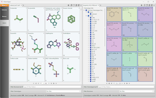

&nbsp;</img>

# Welcome to ChemoTyper

## ChemoTyper application

The ChemoTyper application is a tool that allows for searching and highlighting chemotypes (chemical substructures or subgraphs) in datasets of molecules. Typical applications are as follows.

*   Searching for structural alerts for toxicity in chemical structure files
*   Filtering of chemical structures according to chemotypes
*   Visualization and inspection of chemotypes
*   Grouping of chemicals according to chemotypes, and
*   Fingerprinting of chemical structure sets against chemotypes

The ChemoTyper application houses the [​ToxPrint](https://github.com/mn-am/toxprint) chemotypes library. The [​ToxPrint](https://github.com/mn-am/toxprint) chemotypes library is a public set of chemotypes developed by Altamira LLC for the CERES project of the U.S. FDA Center for Food Safety and Applied Nutrition (CFSAN). The [​ToxPrint](https://github.com/mn-am/toxprint) chemotypes library contains three basic subsets.

*   Generic structural fragments
*   Ashby-Tennant genotoxic carcinogen rules [​(J Ashby, RW Tennant 1988)](http://dx.doi.org/10.1016/0165-1218(88)90114-0)
*   Cancer TTC categories [​(R Kroes *et. al.* 2004)](http://dx.doi.org/10.1016/j.fct.2003.08.006).

## References

*   [​C Yang, A Tarkhov, J Marusczyk, B Bienfait, J Gasteiger, T Kleinoeder, T Magdziarz, O Sacher, CH Schwab, J Schwoebel, L Terfloth, K Arvidson, A Richard, A Worth, J Rathman. New Publicly Available Chemical Query Language, CSRML, To Support Chemotype Representations for Application to Data Mining and Modeling. *J. Chem. Inf. Model.* **2015**, *55(3)*, 510-528.](http://pubs.acs.org/doi/abs/10.1021/ci500667v)

## Contact

For technical support please contact [​support@mn-am.com](mailto:support@mn-am.com).

## How to Cite ChemoTyper

Please use the full information provided in the section "Cite this repository" in the "About" tab or as a minimum as follows.

(a) Yang *et al.* *J. Chem. Inf. Model.* **2015**, *55(3)*, 510-528 (DOI: doi.org/10.1021/ci500667v). (b) Chemotyper application by MN-AM, Version 1.3 r14761, github.com/mn-am/chemotyper, accessed on $DATE.

## Acknowledgement

The ChemoTyper application was developed by Molecular Networks GmbH, Erlangen, Germany under a contract from the U.S. FDA Center for Food Safety and Applied Nutrition (CFSAN), Office of Food Additive Safety.

The XML-based substructure (or chemotype) definition language CSRML was co-developed in collaboration with Altamira LLC, Columbus, OH, USA.

Visit the [​website](https://www.mn-am.com) of Molecular Networks GmbH and Altamira LLC.
